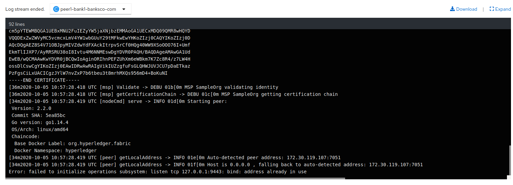

### Prerequisite

before proceeding to this step, make sure that the PKI ((Public Key Infrastructure) are generated, otherwise start by generating them:
[link to the feature-generationPKI-initNetwork.](./feature-generationPKI-initNetwork/README.md)

### Apply template
```sh 
oc apply -f all-peers-template.yaml
```
### Process and create template entities

```sh
oc process -f all-peers-template | oc create -f -
``` 

### IMPORTANT
Le template all-peers-template declenche une erreur liée au ports, j'ai essayé de la contourner en faisant un forword à l'image de ce qui est fait dans les yaml de docker-compose mais ça n'a pas abouti.
 

Pour débuger J'ai crée un simple template avec deux containers avec les mêmes paramètres que ceux implementés dans les fichiers yaml de docker-compose :

```sh
              - name: CORE_PEER_ADDRESS
                value: peer1.bank1.banksco.com:7051
              - name: CORE_PEER_GOSSIP_BOOTSTRAP
                value: peer0.bank1.banksco.com:7051
              - name: CORE_PEER_GOSSIP_EXTERNALENDPOINT
                value: peer1.bank1.banksco.com:7051
              - name: CORE_PEER_GOSSIP_ORGLEADER
                value: "false"
              - name: CORE_PEER_GOSSIP_USELEADERELECTION
                value: "true"
              - name: CORE_PEER_ID
                value: peer1.bank1.banksco.com
              - name: CORE_PEER_LOCALMSPID
                value: Bank1MSP

              - name: CORE_VM_ENDPOINT
                value: unix:///host/var/run/docker.sock
``` 
mais ça n'a pas marché non plus et cette fois l'erreur est différente :

 
