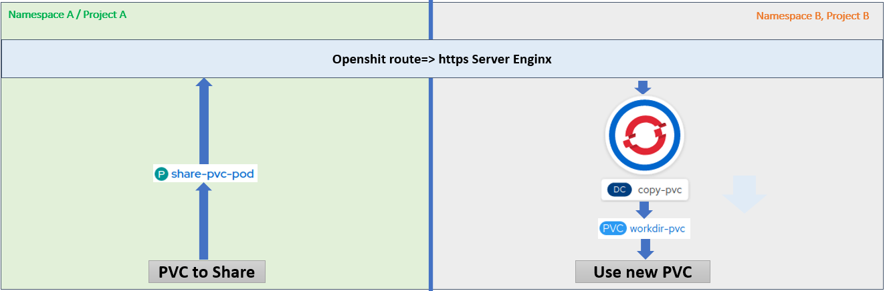

### Problématique

L'equipe IBM  Blockchain voudrait partager un volume de données (des clés, et des configurations) entre 2 namespaces.
 

### Solution I : Partage d'un volume PVC via un serveur https (Enginx)

Cette solution consisite à monter un volume (PVC) et le mettre en ligne via une route Openshift et un serveur (Enginx).

Le volume de namespcae A sera accessible depuis tous les autres namespaces via une adresse URL.
 
### Deployment : Namespace A

Pour déployer cette solution, il suffit de vous rendre sur votre cluster openshift, vous vous connectez puis charger et executer le template ci-joint (share-pvc-template.yaml).

Le template nécessite un param "PVCNAME" pour définir le nom de volume Claim (PVC) à monter et partager.

Pour tester cette solution nous allons utiliser le nom de volume Claim "fabric_pvc" déjà crée dans le poc suivant :

[./feature-generationPKI-initNetwork/README.md](https://eu-de.git.cloud.ibm.com/gbs-rh/devops/refimps/g4sam1/bouygues-bloc/bouygues-blockchain/bouygues-poc/-/blob/feature-generationPKI-initNetwork/README.md)

### Apply template
```sh 
oc apply -f share-pvc-template.yaml
```
### Process and create template entities

```sh
 oc process  share-pvc-template -p PVCNAME=fabric-pvc | oc create -f -
``` 
### RESULT
https://task-pv-pod-route-mbarekrayad-ma.bouygues-bloc-160008566-f72ef11f3ab089a8c677044eb28292cd-0000.sjc03.containers.appdomain.cloud/crypto-config/ordererOrganizations/banksco.com/orderers/orderer.banksco.com/tls/ca.crt


### USECASE => Déployement d'un ordrer dans un autre Namespace (B)
 

### Copier les fichiers à partir du serveur Enginx vers un nouveau PVC local

Il faut d'abord s'assurer que le serveur Enginx est bien démarré et les fichiers de PVC d'origine sont bien accessibles via la route Openshift.

Pour copier ces fichiers il suffit de déployer le template "copy-pvc-from-http-template.yaml" en passant les curls des fichiers en param.env

PS1: vous pouvez modifier le template et utiliser un fichier command.sh 
PS2: j'ai essayé de copier tout un répértoire en utilisant wget mais ça n'a pas marché, du coup j'ai opté pour cette solution basée sur curl.

```sh 
oc apply -f copy-pvc-from-http-template.yaml
```
#### Process and create template entities

```sh
oc process  copy-pvc-template  --param-file=param.env | oc create -f -
```
### Génerer un ordrer en se basant sur le nouveau pvc
### Apply template
```sh 
oc apply -f ordrer-pvc-http-template.yaml
```
#### Process and create template entities

```sh
oc process  tpl-orderer | oc create -f -

