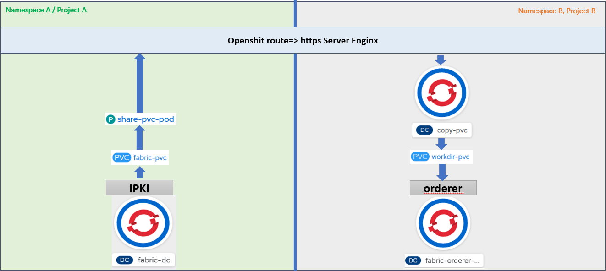

# Deployment of the pods in the project A

To apply the solution we will begin to deploy the pods containing PKI from the branch: feature-generationPKI-initNetwork. See the chapter [Generating PKI Genesis block and Exchange network transactions initialization](Generating-PKI-Genesis-block-and-Exchange-network-transactions-initialization).

The data in the PVC (fabric-pvc) will be shared with another pods in the different projects.

When the pods are deployed, a yaml file is used to create a server Nginx with a Https URL. The file is lacated in the branch: feature-share-pvc-via-http
* *git checkout feature-share-pvc-via-http*
* *git checkout -b feature-share-pvc-via-http_deploy*

Create the template resource for deploying components
* *oc apply -f share-pvc-template.yaml*

Create all componenets defined in the template resource
The value for the variable PVCNAME is set to **fabric-pvc** when deploying the Nginx pod.
* *oc process  share-pvc-template -p PVCNAME=fabric-pvc | oc create -f -*

> **Note**: The value of the variable PVCNAME is the name of the PVC used to store data.

**RESULT**
https://task-pv-pod-route-mbarekrayad-ma.bouygues-bloc-160008566-f72ef11f3ab089a8c677044eb28292cd-0000.sjc03.containers.appdomain.cloud/crypto-config/ordererOrganizations/banksco.com/orderers/orderer.banksco.com/tls/ca.crt


## Use case => Deployment of the orderer in the new namespace (B)
 

# Copier les fichiers à partir du serveur Enginx vers un nouveau PVC local

Il faut d'abord s'assurer que le serveur Enginx est bien démarré et les fichiers de PVC d'origine sont bien accessibles via la route Openshift.

Pour copier ces fichiers il suffit de déployer le template "copy-pvc-from-http-template.yaml" en passant les curls des fichiers en param.env

PS1: vous pouvez modifier le template et utiliser un fichier command.sh 
PS2: j'ai essayé de copier tout un répértoire en utilisant wget mais ça n'a pas marché, du coup j'ai opté pour cette solution basée sur curl.

Set the param.env file
* *`route=$(oc get routes share-pvc-pod-route -o jsonpath='{.spec.host}')`*
* *`sed -i -e "s/default/$route/g" param.env`*

Create template resource for the orderer
```sh 
oc apply -f copy-pvc-from-http-template.yaml
```
### Process and create template entities

```sh
oc process  copy-pvc-template  --param-file=param.env | oc create -f -
```

## Génerer un ordrer en se basant sur le nouveau pvc
Create the orederer pod using the pvc in the namespace A
```sh 
oc apply -f ordrer-pvc-http-template.yaml
```
### Process and create template entities

```sh
oc process  tpl-orderer | oc create -f -

