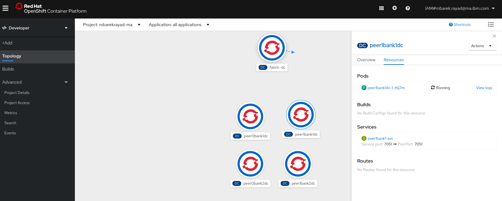
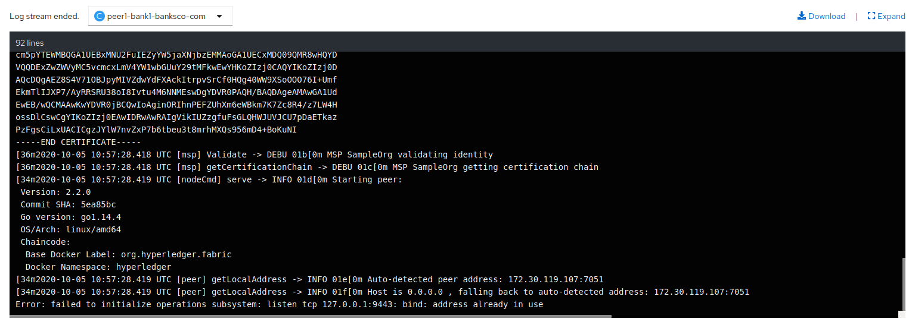
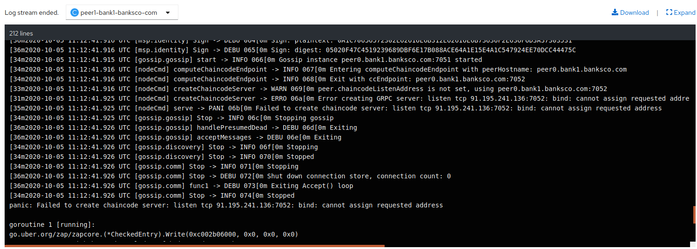

### Prerequisite

Before proceeding to this step, make sure that the PKI ((Public Key Infrastructure) are generated, otherwise start by generating them:
[./feature-generationPKI-initNetwork/README.md](https://eu-de.git.cloud.ibm.com/gbs-rh/devops/refimps/g4sam1/bouygues-bloc/bouygues-blockchain/bouygues-poc/-/blob/feature-generationPKI-initNetwork/README.md)

### Apply template
```sh 
oc apply -f all-peers-template.yaml
```
### Process and create template entities

```sh
oc process all-peers-template | oc create -f -
``` 
### RESULT
 
### IMPORTANT
En essaynt de déployer les peers sous forms des containers dans le même pod (template : all-peers-one-pod-template), j'ai eu une erreur liée aux ports malgré la définittions des services à l'image de ce qui est fait dans les fichiers yaml de docker-compose .
 

Et pour débuger J'ai crée un simple template (tow-peers-template) avec deux containers et les mêmes paramètres que ceux implementés dans les fichiers yaml de docker-compose :

```sh
              - name: CORE_PEER_ADDRESS
                value: peer1.bank1.banksco.com:7051
              - name: CORE_PEER_GOSSIP_BOOTSTRAP
                value: peer0.bank1.banksco.com:7051
              - name: CORE_PEER_GOSSIP_EXTERNALENDPOINT
                value: peer1.bank1.banksco.com:7051
              - name: CORE_PEER_GOSSIP_ORGLEADER
                value: "false"
              - name: CORE_PEER_GOSSIP_USELEADERELECTION
                value: "true"
              - name: CORE_PEER_ID
                value: peer1.bank1.banksco.com
              - name: CORE_PEER_LOCALMSPID
                value: Bank1MSP

              - name: CORE_VM_ENDPOINT
                value: unix:///host/var/run/docker.sock
``` 
mais ça n'a pas marché non plus :

 
