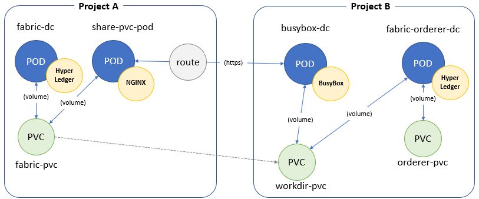

For the use case, we will deploy the pod for generating PKIs in the project A and the orderer in the project B. The persistent volume claim in the project A will provide the PKIs to the ordererer in the project B.

# Deployment of the pods with data (PKI, Genisis block, ...) stored in pvc in the project A

**Generating PKI, Genisis block,... in the pod**

To apply the solution we will begin to deploy the pods containing PKI from the branch: feature-generationPKI-initNetwork. See the chapter [Generating PKI Genesis block and Exchange network transactions initialization](Generating-PKI-Genesis-block-and-Exchange-network-transactions-initialization).

The data in the PVC (fabric-pvc) will be shared with another pods in the different projects.

**Create the Nginx server**

When the pods deployed, a yaml file is used to create a server Nginx with a Https URL. The file is located in the branch **feature-share-pvc-via-http**
* *`git checkout feature-share-pvc-via-http`*
* *`git checkout -b feature-share-pvc-via-http_deploy`*

Create the template resource for deploying components. Use the yaml file: **share-pvc-template.yaml**
* *`oc apply -f share-pvc-template.yaml`*

Create all components defined in the template resource

> The value for the variable PVCNAME is set to **fabric-pvc** when deploying the Nginx server.

* *`oc process share-pvc-template -p PVCNAME=fabric-pvc | oc create -f -`*

> **Note**: The value of the variable PVCNAME is the name of the PVC used to store data. 

> The Https URL is defined in the route.

> https://task-pv-pod-route-**<namespace A>**.bouygues-bloc-160008566-f72ef11f3ab089a8c677044eb28292cd-0000.sjc03.containers.appdomain.cloud/crypto-config/ordererOrganizations/banksco.com/orderers/orderer.banksco.com/tls/ca.crt
> 

# Deployment of the orderer in the project B using the data (PKI, Genisis block, ...) copied

**Copy all files from the fabric-pvc to the persistent volume claim located in the project B**

Activate the project B
* *`oc project <project B>`*

Set the param.env file
* *`route=$(oc get routes share-pvc-pod-route -o jsonpath='{.spec.host}')`*
* *`sed -i -e "s/default/$route/g" param.env`*

Commit the branch
* *`git commit -am 'setup the param file'`*

Create the template resource for deploying components. Use the yaml file: **copy-pvc-from-http-template.yaml**
* *`oc apply -f copy-pvc-from-http-template.yaml`*

Create all components defined in the template resource
* *`oc process  copy-pvc-template --param-file=param.env | oc create -f -`*

**Deploy the orderer using all files copies (KPIs) in the local pvc**

Create the template resource for deploying components. Use the yaml file: **ordrer-pvc-http-template.yaml**
* *`oc apply -f ordrer-pvc-http-template.yaml`*

Create all components defined in the template resource
* *`oc process  tpl-orderer | oc create -f -`*

# Result
